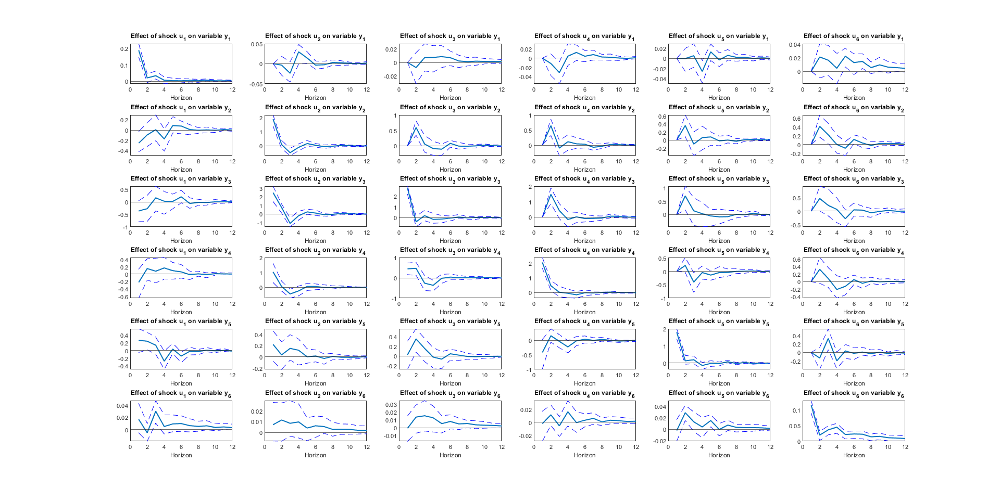

# Multivariate Time Series Analysis (SoSe 2025)
*Home Assignment — Multivariate Time Series Analysis*

> This repository contains my solution for the Multivariate Time Series Analysis home assignment (SoSe 2025).  
> The goal is to analyze German macroeconomic data using a Vector Autoregression (VAR) model, including model selection, Granger causality, impulse response analysis, and forecasting evaluation.

This project implements a classical VAR model for German macroeconomic indicators using MATLAB. The data include core inflation (HICP excl. food and energy), industrial production, orders received, business expectations, energy prices, and the ECB interest rate. The analysis explores the dynamic interactions between these variables and the propagation of shocks, particularly to energy prices.

---

## Overview
The script performs the following tasks:
1. Loads and transforms monthly data (2005M1–2024M12) into stationary growth rates.
2. Selects optimal VAR lag order based on AIC and BIC criteria.
3. Conducts block-wise Granger causality tests to determine predictive relationships.
4. Computes impulse response functions (IRFs) with 95% confidence intervals using Cholesky decomposition.
5. Performs rolling-window forecasts and evaluates model performance via RMSE.

---

## Files
- **HA_MVTSAF_SS2025.m** — Main MATLAB script (data processing, VAR estimation, IRFs, and forecasting).
- **Germany_Macro_Monthly.mat** — Dataset containing German macroeconomic variables.
- **HA_MVTSAF_SS2025.pdf** — Written report and interpretation.
- **/solution/** — Output and figures folder.

---

## Requirements
- MATLAB R2020b or newer  
- Econometrics Toolbox (for `varm`, `gctest`, and `irf`)

---

## Usage
1. Place all files in the same folder.
2. Open MATLAB in that directory and run:
   ```matlab
   HA_MVTSAF_SS2025

---

## Output Example

The following Impulse Response plot shows the contemporanous effect of one unit shock on each other.


