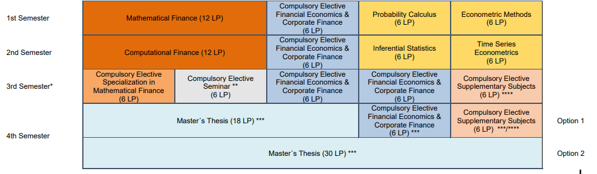

# Master_CAU

This repository collects selected projects and code developed during my master's studies in [Quantitative Finance](https://www.studium.uni-kiel.de/de/studienangebot/studienfaecher/quantitative-finance-ma).

The focus of these projects ranges from statistical computing and financial modeling to risk analysis and data visualization, depending on the course context.

## Curriculum Overview

The following diagram shows the study plan for the M.Sc. Quantitative Finance program at CAU Kiel:

*Source: FPO Quantitative Finance M.Sc. 2021 – CAU Kiel*

## Structure

The repository is organized by semester and includes:

- Course-specific code (e.g. Python, R, MATLAB)
- Project assignments
- Dashboards and visualizations
- Utility scripts

> Note: This is a personal academic archive. Not all content is intended for public use or fully documented yet.

## Disclaimer

This repository **does not contain personal solutions to official coursework submissions**, exams, or graded assignments.  
It includes only personal notes, self-written project work, and public components of home assignments where appropriate.

## License

Unless otherwise stated, contents are for educational and non-commercial use only.
